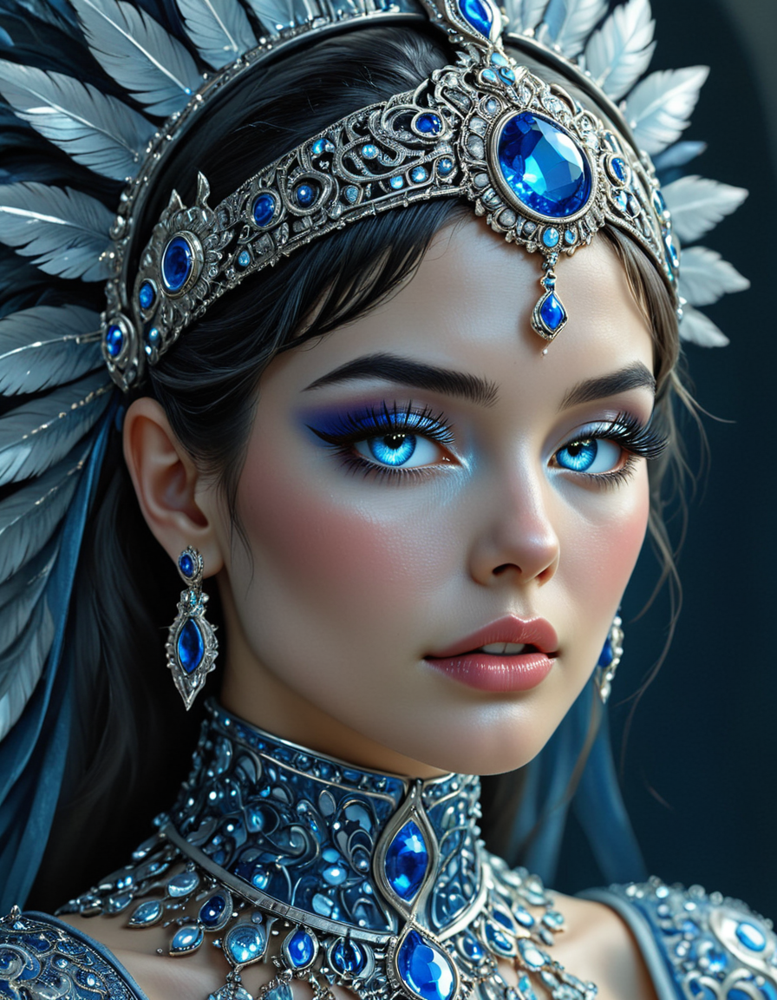
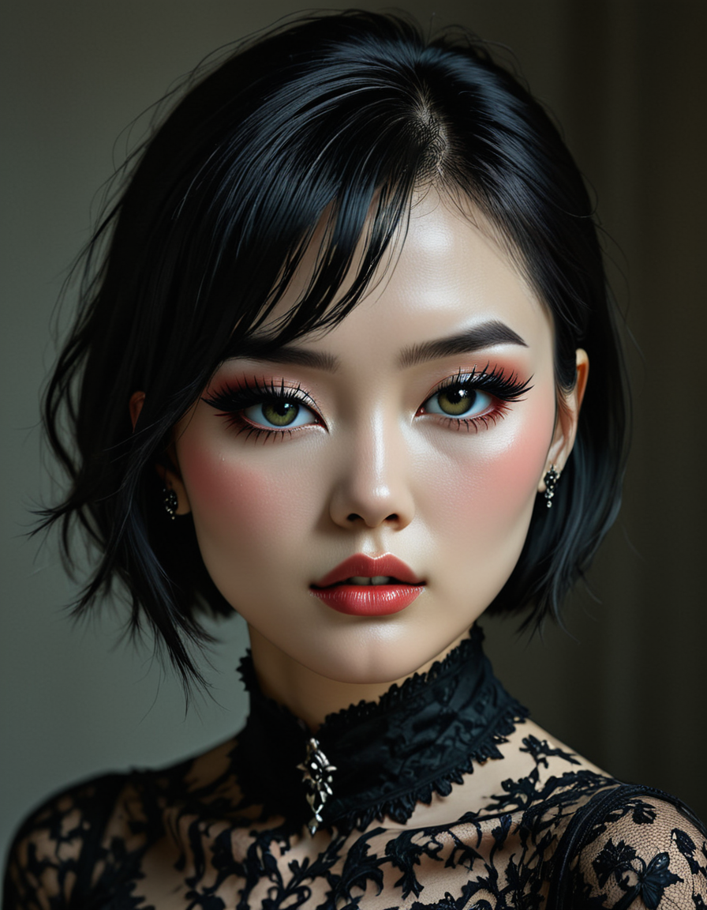
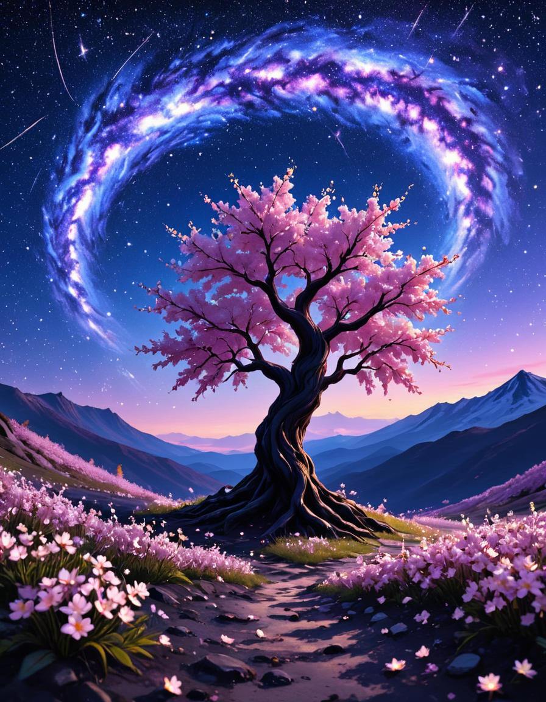
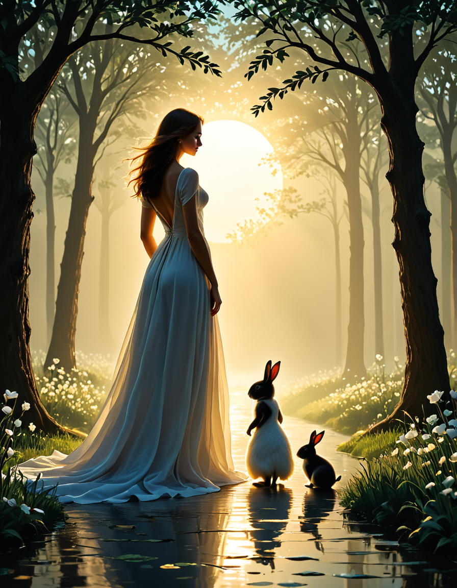
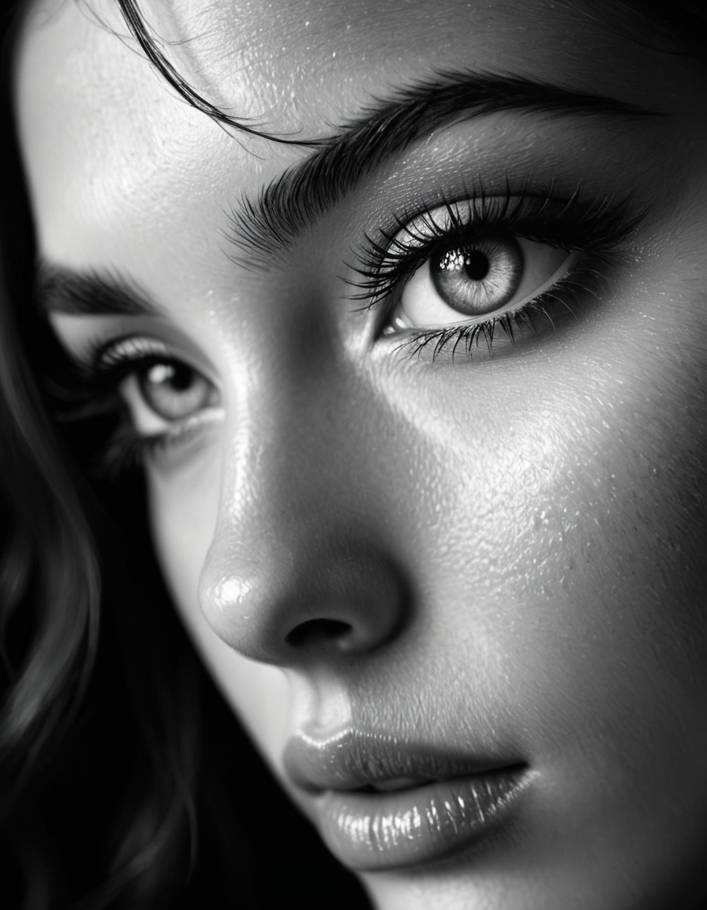
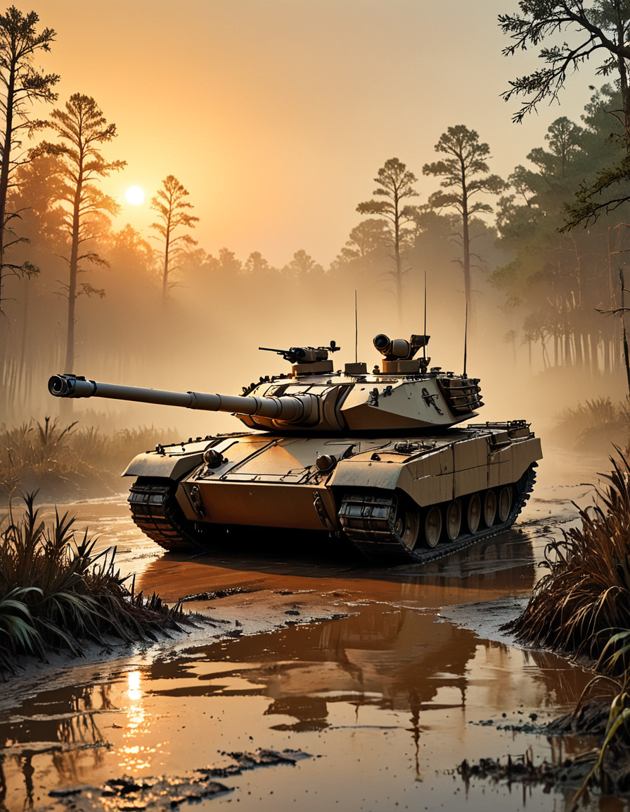
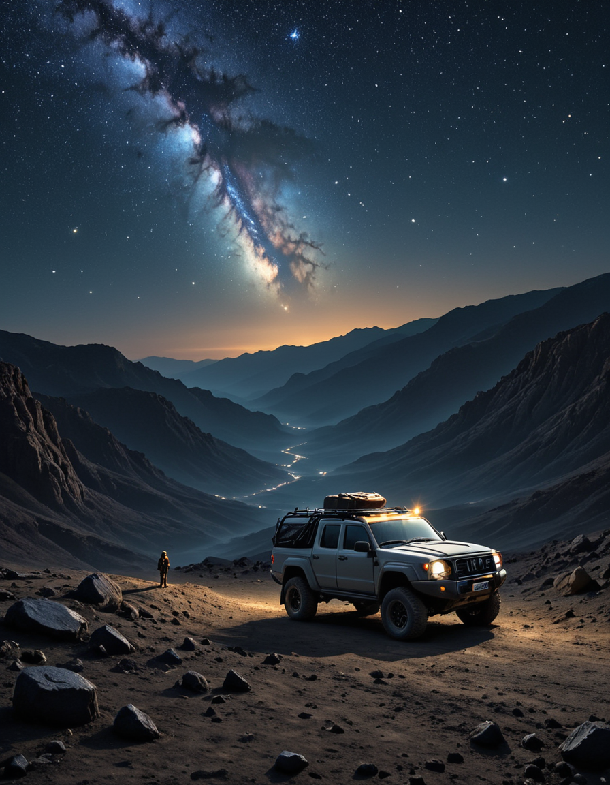

# 🌩️ Typhoon (SDXL)

> **📢 Willkommen bei Typhoon SDXL – einem stilisierten, filmischen Modell, das für Klarheit, Präzision und den gelegentlichen kunstvollen Overkill entwickelt wurde.**
> Dies ist *kein* Modell für rohen Realismus. Es hat Meinungen. Starke sogar.

---

---

## 🧠 Über

Typhoon SDXL begann als geplante Fortsetzung von Tornado – aber die Dinge eskalierten. Was als *Tornado v3* begann, entwickelte eine eigene Identität und entwickelte sich schließlich zu einem eigenständigen Modell mit einem ausgeprägten, stilisierten Realismus, der filmische Beleuchtung, visuelle Tiefe und äußerst saubere Details in Einklang bringt.

Dieses Modell wurde von Grund auf mit Folgendem aufgebaut:
- ✅ Vollständiges SDXL 1.0 Training (kein Merge)
- ✅ Saubere, kuratierte Datensätze mit Schwerpunkt auf Motiv + Beleuchtung
- ✅ Eine Reihe von benutzerdefinierten LoRAs, die selektiv wieder zusammengeführt wurden
- ✅ Manuelle Abstimmung durch Merge-Gewichtung, Stilausgleich und... Trial-by-GPU-Failure

> Fun Fact: 1 von 4 Trainingsläufen ist fehlgeschlagen. Ja, Ihre Prompts sind nicht das Einzige, was instabil wird.

---

## 🌪️ Was unterscheidet Typhoon SDXL?

- **Stilisierte Präzision:** Standardausgaben sind lebendig, detailreich und leicht poliert – wobei "sauberer Realismus" gegenüber dokumentarischem Mut bevorzugt wird.
- **Porträt-Grade-Qualität:** Nahaufnahmen sind scharf, definiert und benötigen keinen Adetailer.
- **Filmtiefe & Beleuchtung:** Überarbeitetes Lichtverhalten sorgt für mehr Dramatik pro Pixel.
- **Prompt-Einfachheit:** Keine Triggerwörter. Beschreiben Sie einfach, was Sie wollen. Im Ernst.

Erwarten Sie starke Highlights, kräftige Beleuchtung, kontrastreiche Renderings und eine Ästhetik, die sich auf halbem Weg zwischen der realen Welt und einem Konzeptkunst-Board befindet.

> ⚠️ Es *kann* rohen Realismus – aber es wird nicht standardmäßig dort landen. Sie müssen es anstoßen.

---

## 📦 Modellmerkmale

| Merkmal               | Anmerkungen                                                                 |
|-----------------------|-----------------------------------------------------------------------|
| Basismodell            | SDXL 1.0                                                              |
| Auflösung            | Native 1024x1024                                                      |
| Standardästhetik     | "Gerendert echt" – sauberer, lebendiger, filmischer Realismus                     |
| Nahaufnahmen Leistung  | Exzellent – kein Adetailer erforderlich                                       |
| Beleuchtung & Komposition| Verbesserte Tiefe, starke Schatten, ausgewogener Kontrast                     |
| Prompting-Stil       | Natürliche Sprache und/oder Tag-basiert – beides funktioniert gut                    |
| NSFW-Ausgabe           | **Instabil** – kastrierte Basis, teilweise Wiederherstellung, mit Vorsicht verwenden   |

---

## ⚙️ Empfohlene Einstellungen

Diese wurden auf Forge WebUI getestet, sollten aber gut auf die meisten SDXL-Schnittstellen übertragbar sein.

- **CFG-Skala:** `0.3 – 0.8`
  > Der Sweet Spot scheint je nach Beleuchtung und Szenenkomplexität bei `0.5 – 0.7` zu liegen.

- **Sampler:**
  - `DPM++ 2M Karras` (🥇 empfohlen)
  - `Euler`, `Euler A`
  - `DPM++ SDE`
  - Die meisten üblichen Verdächtigen funktionieren gut

- **Schritte:** `15+`
  > Mehr Schritte = mehr Details, aber nach etwa 30 abnehmendem Ertrag

- **Gesichtswiederherstellung:**
  > ❌ Deaktivieren Sie es. Besonders bei Nahaufnahmen – es trübt die Augen.

- **Prompting:**
  - Beschreibende Satz-Stil-Prompts sind sehr effektiv
  - Tag-Stil funktioniert auch, besonders für Konzeptkunst oder Fantasy-Stile

---

## ✨ Stilpassung

Typhoon SDXL eignet sich am besten für:
- Porträts und Nahaufnahmen
- Filmische Kompositionen
- Weicher Realismus und Fantasy-Realismus
- Stilisierte Konzeptkunst und saubere Szenen im Render-Stil

Sie erhalten kräftige Grafiken mit Tiefe, reicher Beleuchtung und glatten, aber definierten Oberflächendetails.

---

## 📷 Beispielausgabe

Alle Bilder wurden **nativ** mit Typhoon SDXL ohne externe LoRAs, Inpainting oder Fixierer generiert. Was Sie sehen, ist reine Modellausgabe.

<table> <tr> <td></td> <td></td> <td></td> <td></td> <td></td> </tr> <tr> <td></td> <td></td> <td></td> <td></td> <td></td> </tr> </table>

---

## 🛠️ Hinter dem Sturm

Der Aufbau von Typhoon SDXL war keine gerade Linie. Der Prozess umfasste:

1. **Basispunkt-Training** – Beginnend mit sauberem SDXL 1.0
2. **Gezielte LoRA-Entwicklung** – Benutzerdefinierte LoRAs wurden für Beleuchtung, Gesichtsdetails, Anatomie und Stil trainiert
3. **Manuelle Zusammenführungsabstimmung** – Jede LoRA wurde durch experimentelle Zusammenführungsgewichte + Skalierung wieder zusammengeführt
4. **Handkalibrierung** – Dies war keine ComfyUI-Pipeline – Zusammenführungsreihenfolge und Wertanpassungen wurden manuell vorgenommen.

Ebenfalls während des Prozesses entwickelt:

- [`LoRA Strength Analyzer`](https://github.com/Raxephion/loRA-Strength-Analyser) – Erhalten Sie mathematisch fundierte Ratschläge zu LoRA-Zusammenführungsgewichten
- [`LoRA Epoch Analyzer`](https://github.com/Raxephion/loRA-Epoch-Analyser) – Finden Sie heraus, welche Epoche die Arbeit tatsächlich erledigt hat

Beide Tools sind in der Alpha-Phase und werden bald™ in eine Gradio-UI integriert.

---

## ⚠️ Einschränkungen

- Die NSFW-Ausgabe ist **sehr inkonsistent** – einige Wiederherstellungsarbeiten wurden durchgeführt, aber YMMV
- Die Standardästhetik lehnt sich an "stilisiert-real" an – kiesiger Realismus muss erzwungen werden
- Hochglanz-Beleuchtung kann Haut oder Stoff überbetonen, sofern sie nicht ausgeglichen ist
- Wie alle SDXL-Modelle kann auch starkes Prompting zu Abweichungen führen, wenn es schlecht strukturiert ist

---

## 🚫 Nutzungsbeschränkungen

Dieses Modell wird unter einer modifizierten CreativeML Open RAIL-M-Lizenz veröffentlicht:

- ✅ Persönliche, lokale Nutzung wird gefördert.
- ❌ **Nicht mit anderen Modellen zusammenführen** – Das interne Gleichgewicht von Typhoon wird gestört.
- ❌ **Nicht auf öffentliche Generierungsseiten, Bots oder APIs hochladen**.

> Im Grunde: Verwenden Sie es, missbrauchen Sie es nicht. Halten Sie den Sturm lokal.

---

## 📍 Namensnennung

- Basis: Stable Diffusion XL 1.0 (`stabilityai/stable-diffusion-xl-base-1.0`)
- VAE: [stabilityai/sdxl-vae](https://huggingface.co/stabilityai/sdxl-vae)
- Benutzerdefinierte Tools: [Raxephion/loRA-Strength-Analyser](https://github.com/Raxephion/loRA-Strength-Analyser), [Raxephion/loRA-Epoch-Analyser](https://github.com/Raxephion/loRA-Epoch-Analyser)
- Hugging Face Repo: [Raxephion/Typhoon-SDXL-V1](https://huggingface.co/Raxephion/Typhoon-SDXL-V1)

---

## ☕ Unterstützen Sie den Sturm

Wenn Ihnen gefällt, was ich baue – Typhoon, Tornado, Tools und kontrolliertes Chaos – und Sie helfen möchten, die GPUs am Laufen zu halten:

**💖 [https://ko-fi.com/raxephion](https://ko-fi.com/raxephion)**

Es hilft, Rechenleistung, Kaffee und katastrophale Merge-Experimente zu decken.

---

### 🌩️ Genießen Sie den Sturm
